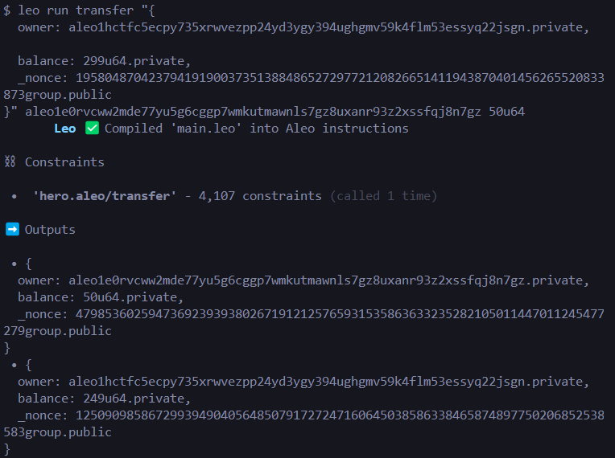

# Submission file for the Aleo task

Transaction:

Deployment:

Deployment hash- at1evq3mzlzam47c48jnfga9ypeqwh3yye732ktrmrgw0nc6eu45c8q4au2df

**To run the files (Requirements)**
* Install rust
* Install leo
* Install snarkos
* run the transaction with leo run (func name) (args)
* deploy with ../deploy.sh